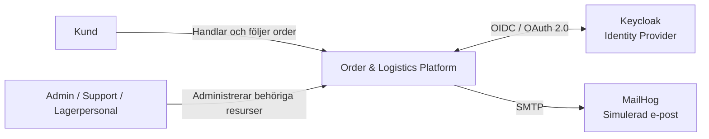
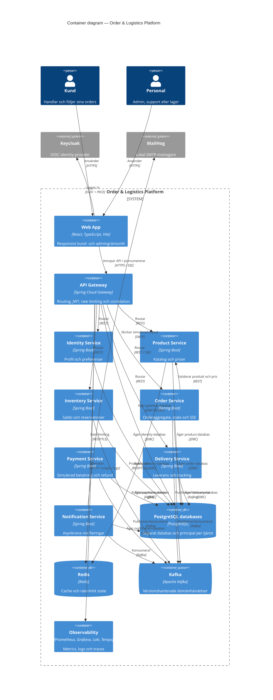
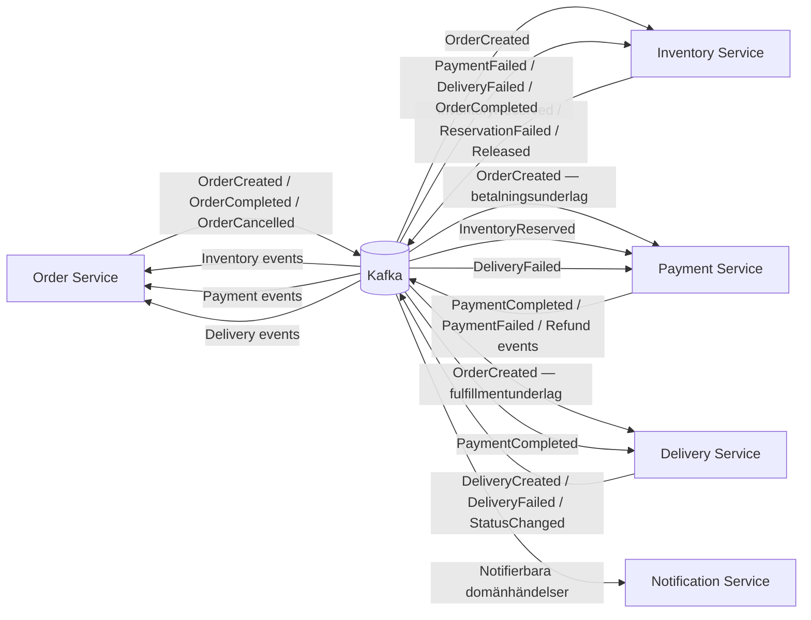
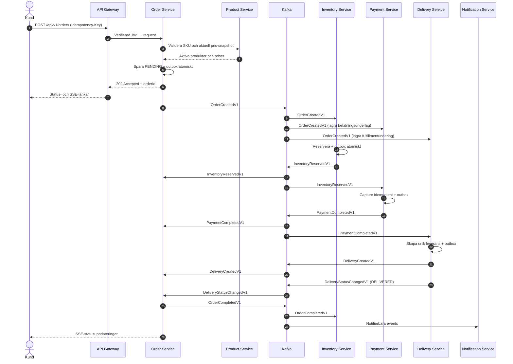
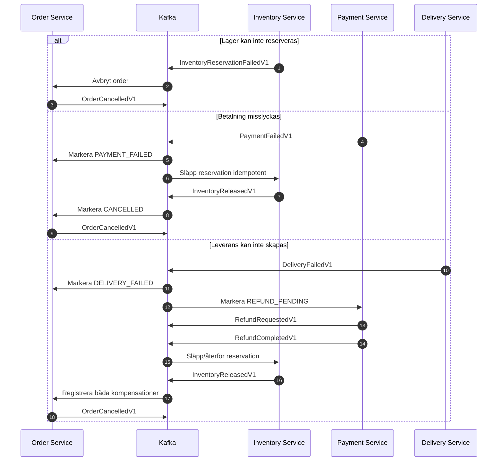
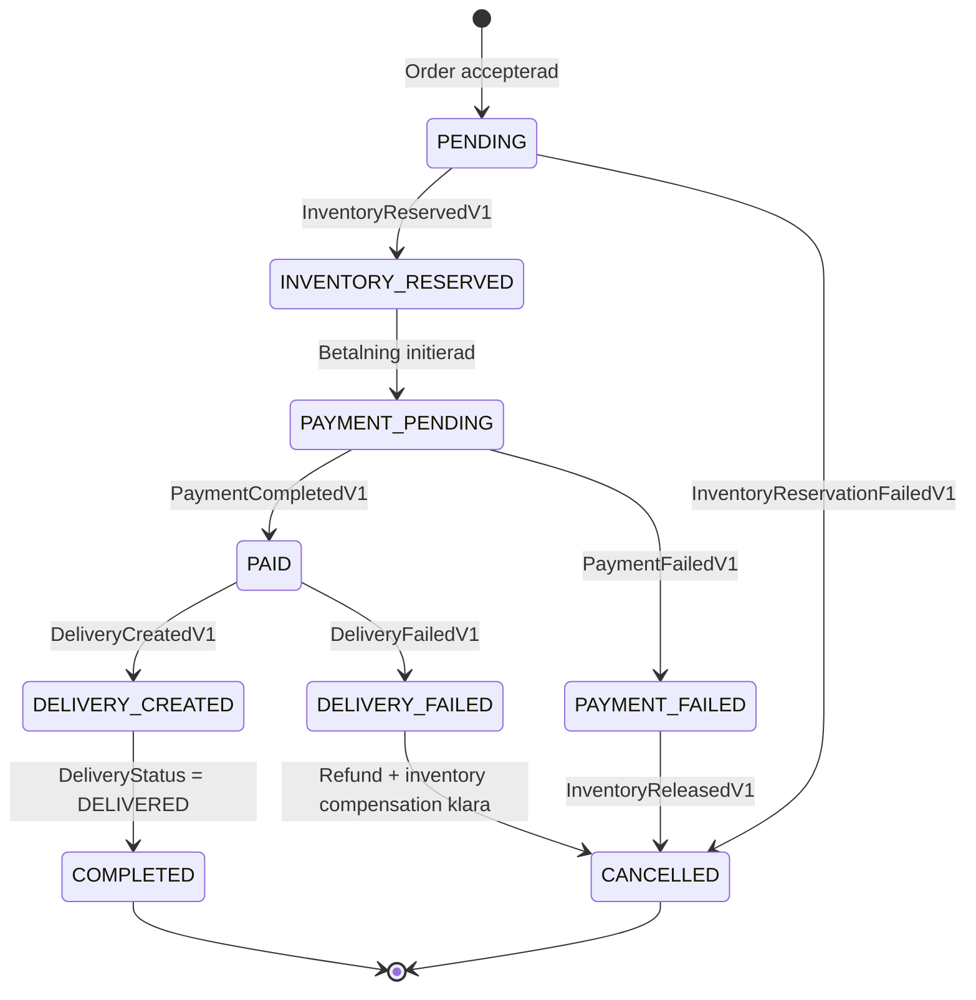
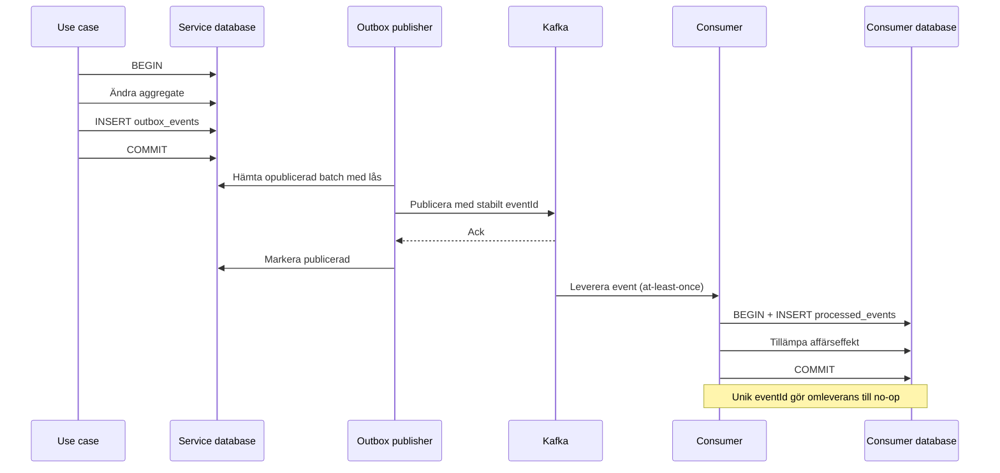
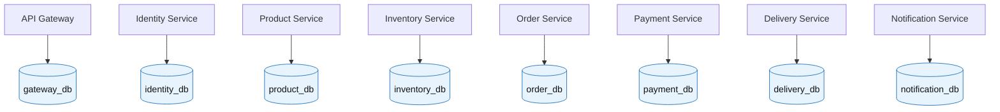

# Arkitekturdiagram

Diagrammen är källkod i Mermaid och ska uppdateras tillsammans med arkitekturen.

## System context

## C4 container-diagram

`PostgreSQL databases` visas som en container för läsbarhet men representerar åtta logiskt separata databaser med separata principals och inget korsägande.

## Tjänster och asynkrona fakta

## Saga-sekvens — lyckat flöde

## Saga-sekvens — kompensationer

## Order state machine

## Transactional outbox och idempotent consumer

## Databasägarskap

Det finns avsiktligt inga pilar mellan en tjänst och en annan tjänsts databas.
